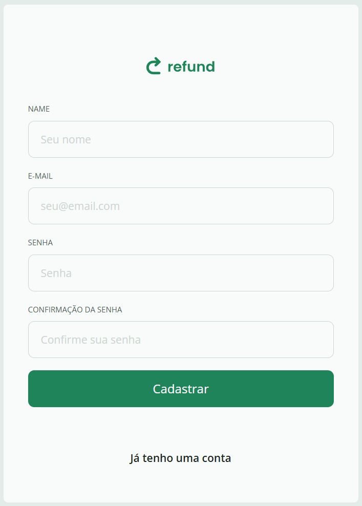
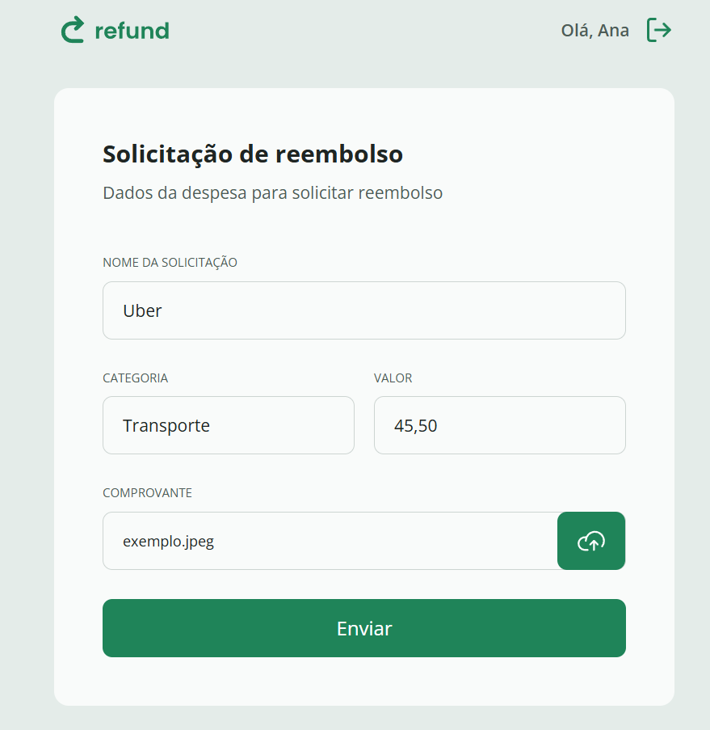
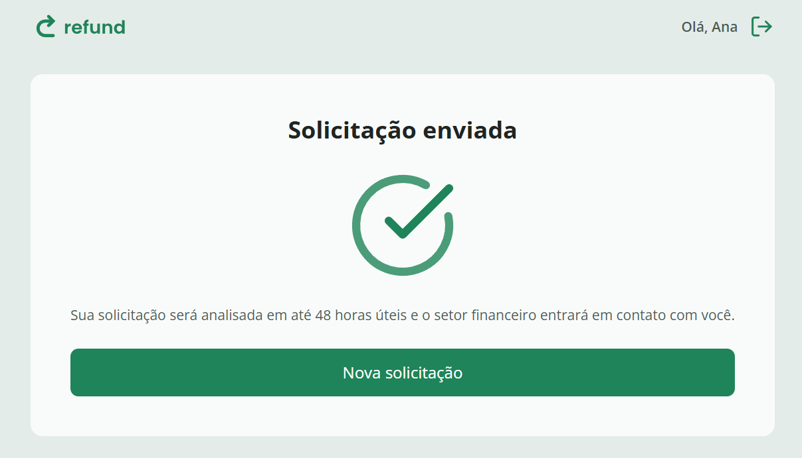
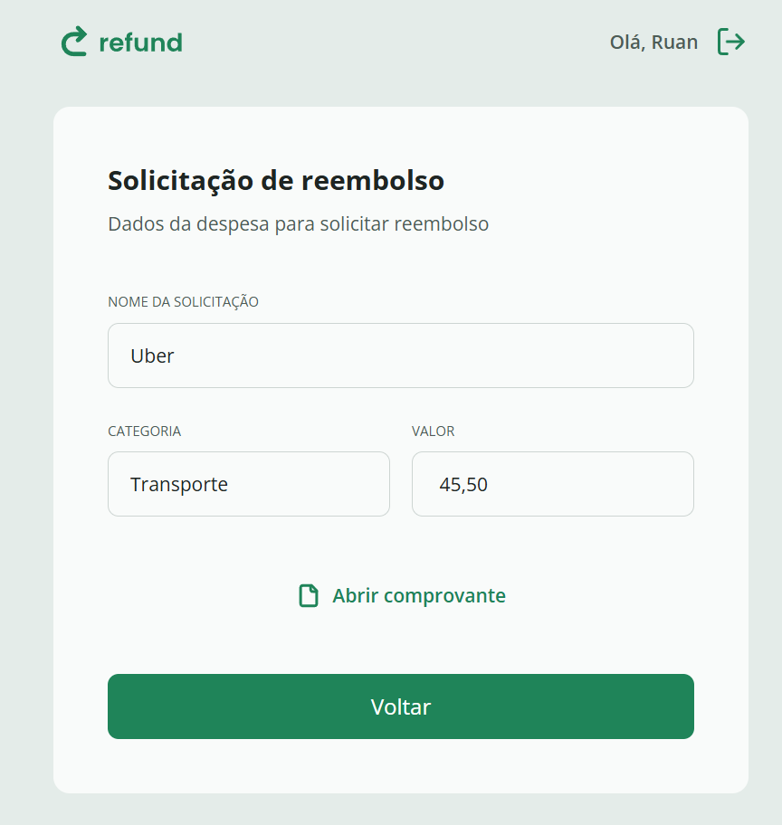

# Refund System

Um sistema de reembolsos, front-end + API REST para gerenciamento de dados.

## Repositórios

Este sistema é composto por dois repositórios:

- **Front-end web**: https://github.com/ruan-sant/refund-web  
- **API REST (Back-end)**: https://github.com/ruan-sant/refund-api

## Visão Geral

O sistema segue uma estrutura full stack:

- O front-end consome a API REST para listar, criar e gerenciar solicitações de reembolso.
- A API REST implementa as regras de negócio e endpoints para manipular dados de reembolsos.

## Screenshots

### Início

### Cadastro

### Solicitações de Funcionário

### Listagem de Solicitações para Gerente

## Funcionalidades

### Front-end (refund-web)
- Interface web responsiva
- Listagem de reembolsos
- Formulário para criar novas solicitações
- Feedback visual de sucesso / erro

### Back-end / API (refund-api)
- Endpoints REST para:
  - Listar reembolsos existentes
  - Criar nova solicitação de reembolso
  - Buscar detalhes de um reembolso específico
- Estrutura organizada com TypeScript e padrões REST
- Possível integração com banco de dados (Prisma / ORM)

## Tecnologias Utilizadas

**Front-end**
- TypeScript
- React / Vite

**Back-end**
- Node.js
- TypeScript
- Express

## Como Executar

### Back-end / API
1. Clone o repositório
2. Instale dependências: `npm install`
3. Inicie: `npm run dev`

### Front-end
1. Clone o repositório
2. Instale dependências: `npm install`
3. Inicie: `npm run dev`

## Considerações

Este repositório principal não contém código, apenas faz a **organização e documentação do sistema**.

---
